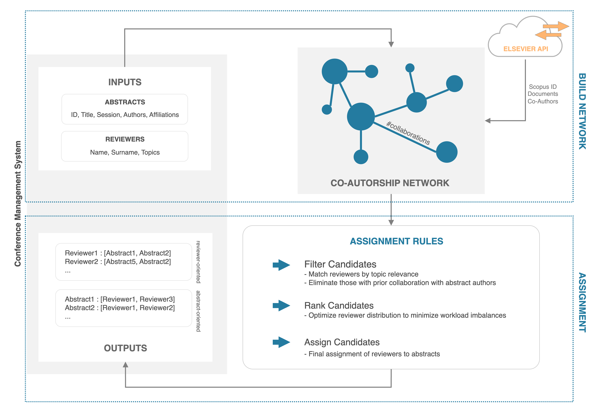

# BITS Abstract Reviewer Assignment



## Requirements

To run this algorithm, install the requirements:

```
pip install -r requirements.txt
```

and get a valid **API Key** for the [Scopus API](https://dev.elsevier.com). 

## Overview

This algorithm automates the assignment of reviewers to abstracts for the BITS conference. It ensures fair and conflict-free assignments based on topics of interest and prior collaboration history. 

Given the network of coauthors, built using `build_net.py`, it is possible to assign to each abstract a set of possible reviewers.
The algorithm finds the possible reviewers from the list of reviewers with the same interest topics


## Output